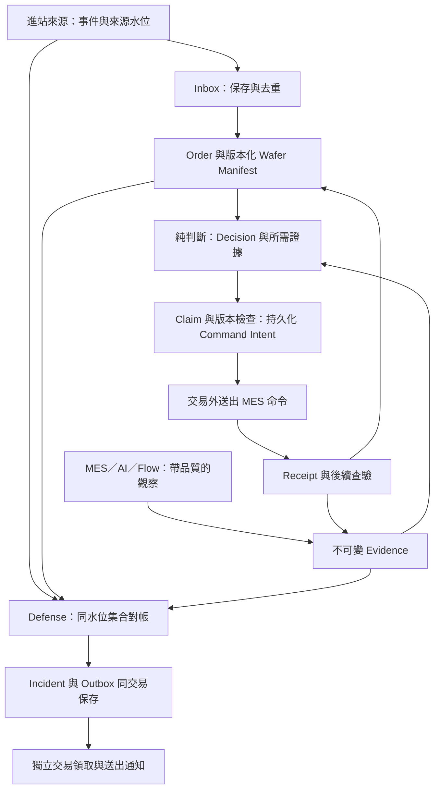

# 整體資料流程與架構檢視

日期：2026-09-20  
範圍：Operation Start、Order／Wafer、來源觀察、Decision、MES Command、查驗、Defense、Outbox、排程與恢復。  
方法：靜態閱讀目前本機程式與既有設計。現場已定：多台、進站紀錄夠久、MES 同一鑰匙一次、重試同一包、結案離開日常名單。完整 Inbox／全廠對帳仍未做。

> 2026-09-23 更新：候選已限制為 `OperationStartTime` 最近 12 小時並以 keyset 分頁；Release 查驗超過 2 小時會開 Incident；SMM Hold 只作進站分流，所有掃片完成與結案只看 `ScanCompletedTime` 及本系統 Default Hold。下文提到 transfer 或 Defect handoff 的內容是當時架構檢視，不是現行業務 gate。

## 整體判斷

現有「Cron 驅動、狀態存 DB、先保存 Intent、再呼叫 MES、下輪查驗」方向可以保留。現階段最值得改善的是資料與控制邊界：**如何證明事件沒有漏、命令沒有被兩個執行者同時送、對帳範圍足夠完整，以及程式重啟後仍知道下一步。**

架構圖上的 Inbox、Claim、Outbox、Cursor 已有不少對應模型或 DAO，但部分執行路徑還沒有落實它們應提供的保證。單一案例在 Fake World 跑完，只能證明那個案例；遇到來源延遲、批量增加或兩個 Cron 重疊，仍需要更完整的契約。

這份文件與前兩份的分工：

- [情境討論](SCENARIO_DISCUSSION.md)：業務條件應該怎麼判斷。
- [維護與查案建議](MAINTAINABILITY_AND_INVESTIGATION_RECOMMENDATIONS.md)：如何讓程式容易修改、證據容易追蹤。
- 本文件：資料如何可靠地流過系統，哪些失敗窗口尚未收斂。

下文的「程式觀察」是目前可直接看到的內容；「失敗時序」是待測試的推演，不代表已重現事故；「建議」尚未實作。相同議題若涉及既有已確認政策，以政策為前提補齊機制，不逕自更改業務要求。

## 建議的責任與資料流

這些是責任邊界，可以維持同一個 Python 專案與同一資料庫，不需要為每個框建立服務。主路徑仍遵守 [C01–C11 單格驗收](ACCEPTANCE_STATE_MACHINE.md)；`SMM_EXCEPTION_DEFENSE` 也可以保留同一 function code，內部劃開提交與送信階段。

## 先處理哪些問題

| ID | 議題 | 主要影響 | 建議順位 |
|---|---|---|---|
| A01 | 事件接收、游標與壞事件隔離 | 漏單、重讀、整批卡住 | 先處理 |
| A02 | Manifest 的獨立來源與更新生命週期 | 空名單無法補齊、錯版本影響判斷 | 先釐清 |
| A03 | 來源品質與按動作取資料 | 查詢失敗被當空、無關來源阻塞 | 先處理 |
| A04 | 每筆交易邊界與外部副作用 | 已送 MES，但本地批次回滾 | 先處理 |
| A05 | Claim、Command 與並行互斥 | 重複／衝突命令、租約被覆寫 | 先處理 |
| A06 | 重試 payload 與 policy 綁定 | 同一命令重送時內容已變 | 先處理 |
| A07 | Defense 的對帳模型與觀察範圍 | 有單無防守被漏掉、假缺口、孤兒漏掃 | 先處理 |
| A08 | Outbox 提交、領取與耗盡處理 | 通知與 DB 不一致、隊首堵塞 | 先處理 |
| A09 | 有界排程、公平性與監控 | 後面訂單永遠取不到、局部故障被掩蓋 | 第二階段 |
| A10 | 控制、scope 與配置變更 | 新設定使舊 Hold 認不出、停用窗口不明 | 先釐清 |
| A11 | Domain 決策與 Pipeline 執行分工 | 排程名稱改變決策表意、投影不一致 | 第二階段 |
| A12 | 跨 process 的 DEV 與 Adapter 契約 | 同程序通過卻無法代表真正 Cron | 第二階段 |
| A13 | 結案、人工接管與剩餘責任 | 關單後未完成責任失去追蹤 | 先釐清 |

## A01 — 事件接收尚未形成可靠的 Inbox／Cursor 流程

**程式觀察**

[set_default_hold.py](../src/vai_hold/application/pipelines/set_default_hold.py) 呼叫 `list_start_events(None)`；這條路徑沒有讀取並推進進站來源的持久化 cursor。雖然有 `inbound.try_record`／`mark_consumed`，主流程沒有以 `list_unconsumed` 作為接收後的獨立消費入口。

缺 Rework／Operation 的事件先開 Incident，尚未進入 `try_record`；每次掃描可能重新遇到同一壞事件。事件迴圈共用交易，其中 `_new_order` 還會查 Flow 取得 Tool ID。

**失敗時序**

來源只保留最近 N 分鐘事件 → 程式停機超過 N 分鐘 → 重啟全掃目前可見事件 → 沒有持久化來源水位或補掃契約，無法證明漏掉哪些事件。另一種情況是某事件解析／DB 約束失敗，拖累同一批其餘有效事件。

**建議設計**

1. 以分頁契約讀事件：事件清單、next_cursor、source watermark、是否完整、查詢狀態。
2. 在短交易保存整頁 Inbox 與接收 cursor；去重鍵必須包含來源 namespace，不假設所有來源的 event_id 全球唯一。
3. 另以可恢復的消費流程建單；保存 `RECEIVED / PROCESSING / CONSUMED / QUARANTINED` 或等價狀態、嘗試次數與最後錯誤。
4. 身分不足的事件也保留原始證據與來源 ID，隔離待補正，不無限卡住後面的有效事件。
5. 「來源已收到」cursor 與「建單已完成」進度分開；不要等 MES 成功才推來源游標，也不要跳過尚未持久化的事件。

**待釐清**：來源 cursor 是否可重播、保留多久、事件是否可修改、scope 外事件日後是否需要回補。這些決定實際補掃策略。

**驗證**：接收後／建單前當機、同頁重送、壞事件夾在正常事件中、來源保留窗口中斷、跨頁重複。

## A02 — Wafer Manifest 不宜附屬在進站事件的一段字串裡

**程式觀察**

建單以 `event.payload.split(',')` 取得 wafer 清單。既有 Order 的分支在 old_ids、new_ids 都非空且集合不同時轉人工審查；當第一次為空、後來事件補上完整清單時，這條分支沒有寫入補齊名單。

過期事件目前是與 `last_evaluated_at / updated_at` 比時間後記 Log；後續仍可能進入 roster 差異判斷。本機「最近評估時間」不是來源 manifest 版本，不能直接代替來源排序依據。

**需要定義的資料所有權**

進站事件負責告知「本輪開始」；Manifest 負責告知「本輪應處理哪些 wafer、slot、任務與版本」。AI 只能提供實際完成結果，不能反向決定應完成名單。

**建議設計**

- 進站資料使用具型別的結構，不以逗號字串承載正式契約。
- 獨立 Manifest envelope：execution key、manifest_id／version、source watermark、完整性、wafer ID／slot mapping、取得狀態。
- 明訂「未取得 → 取得初始完整名單」與「已確認名單 → split／merge／移片變更」是不同轉移；前者可依契約補齊，後者走核准承接或人工處理。
- 原始版本保留，Order 指向適用版本；AI 結果以該版本與本輪身分核對。
- 舊來源版本到達時，保留差異證據但不任意更新現行投影；來源沒有版本保證則明示未知，不用本機時間猜。

**驗證**：空名單稍後補齊、同成員不同排序、舊事件携帶舊名單晚到、真正 split／merge、同 wafer 多項必要 scan。

## A03 — Port 需表達查詢品質，觀察應依動作取必要資料

**程式觀察**

Hold／AI／Flow 有 SourceResult；[SmmPort](../src/vai_hold/application/ports/gateways.py) 的 `list_start_events`／`expected_keys` 回傳裸 list，不能在介面層表達 STALE、查詢覆蓋範圍與水位。SourceResult 的 value 目前是 Any。

[snapshot()](../src/vai_hold/application/services.py) 每次固定查 Hold、Flow、AI，也可能寫回 Wafer。SET、VERIFY、Defense 對資料的需要不同，固定全查增加延遲與故障耦合。

**建議設計**

- SMM 集合查詢也用帶 quality、completeness、watermark 的 envelope；成功的空集合與讀取失敗必須可區分。
- Port 以 `SourceResult[T]` 或具體回傳模型表達資料型別，明訂預期外部錯誤如何正規化；未知程式錯誤不一概吞成空資料。
- 為各動作定義 ObservationPlan：建立 Hold 不依賴 AI；Release 依賴完整、有效且新鮮的 AI／Ownership／交接資料。
- 保留 `NOT_REQUESTED` 或等價觀察標記，不把「這次沒讀 AI」寫成「AI UNKNOWN」或「0 片」。
- 設定各來源的 timeout、查詢预算與 freshness；snapshot 只收證據，持久化由明確步驟執行。
- 批次 API 若可用，可按 Lot 合併讀取；動作前仍驗證必要 freshness／version，不能拿批次快照承諾跨系統原子性。

**驗證**：AI 完全不可用時，合法首次 Hold 仍能處理；對帳來源不可用時顯示資料不足，不回報零缺口。

## A04 — 每個 Order 的交易與外部呼叫需要一致邊界

**程式觀察**

多個 Pipeline 使用一個 UoW 包住訂單迴圈；request usecase 又會自行 commit。[SQLite UoW](../src/vai_hold/adapters/persistence/sqlite/uow.py) commit 後立即 BEGIN，正常離開 context 也會 commit。snapshot 會更新 Wafer，部分 Pipeline 一開始也寫 heartbeat。

因此網路查詢可能發生在已寫入的 DB transaction 中；一次 usecase 的 commit 也可能順便提交同 UoW 前面其他工作的變更。這與文件描述的「每筆訂單自己的短交易」仍有距離。

**失敗時序**

先處理 A 的投影但尚未提交 → B 的 request usecase commit → A 的資料也一起提交；或批次末尾 C 發生例外，先前純觀察／投影更新被回滾。查案者難以只看 Pipeline 步驟判斷持久化界線。

**建議設計**

每張 Order 以固定執行模板處理：

1. 短交易取得執行權與版本。
2. 交易外取得必要外部觀察。
3. 短交易重新核對 Order／控制版本，保存決策與 Command Intent 後 commit。
4. 交易外呼叫 MES。
5. 短交易保存 Receipt；實際效果由後續查驗確認。

不同階段使用清楚的 UoW 範圍；交易 API 採 explicit commit 或 context 自動提交都可，但必須選定一致契約並測試。取得執行權後觀察可能較久，送出前需處理版本／租約失效。

**驗證**：每個切點故障注入；一張 Order 失敗不回滾另一張已完成的工作；網路 timeout 期間沒有長時間持有寫入鎖。

## A05 — Claim 欄位存在，不等於已實作完整租約

**程式觀察**

SQLite `try_claim()` 比對 row_version 後直接寫 claim_owner／claim_until，沒有檢查現有 claim 是否仍有效、是否為其他 Worker 所有。另一 Worker 若讀到新版本，仍可能覆寫有效 claim。

目前 SET Pipeline 有 try_claim；閱讀到的 CHECK／CONFIRM Pipeline 沒有相同領取步驟。Schema 有 logical key 的 UNIQUE，但沒有直接代表「每 Order 最多一個互斥在途動作」的共用約束。這些觀察指出保護機制不完整，仍需並行測試確認各路徑具體結果。

**建議設計**

- Claim 原子条件包含：符合預期版本，且未被領取／租約已過期／是自己的合法續租；回傳 claim token 或 generation。
- 所有會修改同 Order 的路徑，包含查驗、Release、transfer、人工處置，採相同版本協調契約。
- Receipt／查驗回寫核對 Command／Attempt 與 generation，防止舊 Worker 覆蓋新版狀態。
- 明確決定衝突範圍是 Order 還是 Lot。MES 欄位無 Rework 時，同 Lot 不同 Order 的寫入也可能衝突。
- 新 Worker 接到過期租約且存在未明命令，先查驗；租約失效不代表旧 MES 請求取消。
- 本地 fencing 只能保護本地回寫；遠端若不支援條件式命令／冪等鍵，不能宣稱 exactly-once。

**待釐清**：正式是否保證同 scope 單一 Worker？若是，也要涵蓋人工重跑與排程重疊；這可以作為第一階段明確限制，但不能只靠 Cron 錯開一分鐘當互斥。

**驗證**：兩個 Worker 同時 claim、持有效 claim 時被第二 Worker 讀取、lease 到期後舊 Worker 恢復、CHECK 與人工結案並行。

## A06 — 同一 logical command 必須帶著凍結的請求內容

**程式觀察**

[request_hold.py](../src/vai_hold/application/usecases/request_hold.py) 的 retry 沿用 Command，但 HoldCommand 重新從目前 Order 的站點／Route 與目前 settings 的 Memo／User 組裝。ActionCommand 有 payload_hash 欄位，但目前建立這類命令時未填入完整 payload 或其指紋。

HoldPort 的 HoldCommand 也沒有傳送 idempotency_key 的欄位；本地命令 ID 與 MES 真正冪等能力要分開看。

**失敗時序**

第一次 ENHL 暫時拒絕 → 換設定／移站／重啟 → 同 Command ID 重送，但站點或 Memo 已變。歷史看起來是同一命令三次，實際上卻是不同意圖。

**建議設計**

- Intent 保存 canonical payload、payload hash、target occurrence、policy／config version、預期前後條件。
- Retry 預設只能重送凍結 payload；若新觀察證明舊 payload 不再合法，先收斂／作廢舊意圖，再依已確認政策建立新 command。
- 明確區分 `logical_command_id`、每次 `attempt_id`、MES provider request ID。
- 記錄 Prepared、可能已 Dispatch、Receipt Unknown、Verified 的恢復語意；只有 Intent 沒 Receipt 時不能直接推定未送。
- Adapter 能力契約列出是否支援遠端冪等、查 request status、精確 Release、延遲可見。能力未提供就保留限制。

**驗證**：重試間改 Memo／User／站點／policy、送出後回寫前當機、同 payload 多次 Attempt、改 payload 必須產生新意圖。

## A07 — Defense 必須核對「應防守與有效防守」，不能只核對有沒有 Order

**程式觀察**

[defense.py](../src/vai_hold/application/pipelines/defense.py) 的 coverage 比較 `expected_keys()` 與 OPEN Order keys；不是實際有效 Hold keys。Order 已建立但 Hold 失敗，兩邊仍可能相等。

Orphan 掃描的 Lot 來源是 SMM expected keys 加最多 2000 張已知 Order，並非全 scope 的 MES Hold inventory。若一個 Lot 同時不在這兩個集合裡，這條路徑看不到它的孤兒 Hold。

來源 expected_keys 沒有在 Port 定义中说明時間窗、完成退出規則或 watermark，因此也無法僅由介面證明 CLOSED Order 是否應從 expected 排除。

**建議設計**

先將對帳拆成不同問題，使用相同 scope、輪次及來源 cutoff：

| 對帳 | 左邊 | 右邊 | 能找出的問題 |
|---|---|---|---|
| Discovery | 應納管 execution | 已保存 Inbox／Order | 漏事件、漏建單 |
| Protection | 目前仍需防守 execution | 已確認有效 Hold／合法交接 | 有單沒防守、錯站、待查驗 |
| Closure | 已結案 execution | 結案證據與殘留 Hold | 假結案、晚到 Hold |
| Orphan | MES 防守 inventory | 可辨識的 Binding／Order | 有 Hold 沒關聯 |

資料分類至少區分 protected、pending verification、confirmed gap、unknown、legitimately closed、manual disposition、disabled unprotected。每次對帳保存 `reconciliation_run` 的完整性、水位與數量，不把部分掃描當全廠健康。

**待釐清**：MES 是否提供 scope 範圍的 Hold inventory？若只能按已知 Lot 查詢，報告必須標「已知 Lot 範圍」，不能宣稱已檢查所有孤兒。

**驗證**：有 Order 但無 Hold、總數相同 Key 不同、正常結案不形成假缺口、SMM 與 DB 都未知的 Lot 有 Hold、來源只有部分頁、來源 UNKNOWN。

## A08 — Outbox 應先持久化，再領取與送信

**程式觀察**

Defense 同一 UoW 中開 Incident／Outbox、呼叫 notifier、更新 SENT，最後才 commit。這表示新 Outbox 在送信之前可能尚未提交，也讓網路呼叫位於批次交易中。

`list_pending` 取最舊 100 筆 PENDING／FAILED；達重試上限的 row 在迴圈裡直接 continue，仍維持可被下次選中的狀態。

**失敗時序**

- 信已送出，commit 前程式中斷：現場收到信，本地可能沒有相應 Incident／送達紀錄。
- 最前面 100 筆皆已耗盡重試：每次都取到相同 100 筆並跳過，後面新告警可能長期無法發送。
- 兩個 Defense 同時取到相同待送列：沒有 dispatch claim 時可能重複寄送。

**建議設計**

1. Incident 與 Outbox 在短交易一起提交。
2. 同一 function code 的第二階段用新交易 claim 到期通知；交易外寄送，再短交易保存 delivery result。
3. 耗盡轉明確的 EXHAUSTED／人工處理狀態，從自動待送選取排除；保留人工重試入口與歷史。
4. 以通知 ID 做 provider 去重（若支援），否則明示 at-least-once，處理「已寄但 DB 未確認」窗口。
5. 告警失敗不應回滾已完成的 Defense 決策；發信延遲、待送數、耗盡數要可監控。

**驗證**：寄出後／mark_sent 前當機、兩個 dispatcher 並行、100 筆耗盡加第 101 筆新通知、通知服務長期不通。

## A09 — 固定 limit 不是完整的排程策略

**程式觀察**

`list_open` 按 created_at／order_id 取最舊 N 筆；`list_all` 同樣有固定上限。Application 才套 scope filter。雖然 Order 有 next_check_at，這個 list_open 沒依它取到期工作。

主路徑共用 `agent_heartbeat`；其中一支仍更新，不能證明另外三支也有進展。Defense 只在 heartbeat 已存在且過舊時告警，從未啟動的情形也需要另定義。

**失敗時序**

前 500 張單都還在等 AI，每分鐘都被取出；第 501 張需要立即確認 Hold 卻持續取不到。若前面又多是 scope 外訂單，取出後全部跳過，該輪可能沒做任何有效工作。

**建議設計**

- DAO 提供 keyset pagination／到期選取，Application 保留 scope 政策；每輪至少能推进掃描位置。
- 按工作種類與 deadline 選取：未決命令查驗、未防守處理、一般 AI poll、Watchdog；每類保留配額，避免單類工作占滿。
- next_check_at、next_retry_at、verification deadline、最大批次時間各有明確責任，不以 Cron 頻率代替所有 timeout。
- 每支 function code／scope 記錄 started、completed、last progress、oldest due age 與待辦數；另由外部監控整個程序／主機。
- 單筆來源超時應能隔離，總工作量與外部 QPS 有界；不讓一張壞單阻塞全廠。

**驗證**：N+1 張單、前 N 張長期等待／scope 外、單支 Cron 停止、來源延遲、批次耗時超過排程間隔。

## A10 — 配置與控制也有生命週期，不能一律套現在值

**程式觀察**

Order 保存 policy／config version，但 Snapshot 使用目前 settings 的 Memo、User、Code 清單與 policy_version。Control 多處固定 `DEFAULT`；OrderKey／SQL 唯一鍵採三欄，site_id 雖有欄位未進唯一鍵。

**需要明確的決定**

- 正式是否一個 DB 只服務一個 site／scope？若是，先把限制寫明並檢核；若不是，租約、游標、Control、OrderKey、對帳與通知全部都要使用相同 scope 身分。
- 新版本 Memo／User 上線後，舊 Hold 是依當初 Binding 辨認，還是依新設定？不能因合法改設定突然失去 Ownership。
- 既有 Order 使用建立時 policy，還是立即套新 policy？涉及防守站與 Retry 的變更不能靠版本字串更新就完成。
- 停用或 scope 縮小後，已在 MES 的 Hold、未決 Command、Outbox 是否仍由本系統持續管理？

**建議設計**

保存不可變 PolicySnapshot／配置指紋。新命令使用當次政策，重試使用原命令內容；已發出副作用的辨認依已保存 Binding。Control version 在 dispatch 前重驗；若版本變更則重新評估。

定義「新納管範圍」與「既有責任範圍」的退出流程，避免移除 scope 後既有 Hold／未決命令失去所有管理者。重查控制仍不能撤回已在 MES 執行的指令，需把在途窗口列入設計。

**驗證**：改 Memo 後仍能找到舊 Hold、停用恰好发生在 Intent 與 dispatch 之間、scope 縮小、混合版本 Worker、兩個 site 相同 Lot ID。

## A11 — 保留 Domain 的判斷，另外記錄 Pipeline 是否有權執行

**程式觀察**

[plan_action()](../src/vai_hold/domain/derive.py) 在當前 function code 不允許某動作時，直接把 Decision.business_action 改成 NONE。这样會失去「Domain 原本認為下一步應做什麼」的資訊。

例如 Domain 建議 VERIFY_HOLD，但 SET 入口只能 no-op。查案若只看到 action=NONE，容易誤以為系統没有待辦，而非待下一支 Cron 接手。

**建議設計**

分開保留：

- Assessment：觀察支持的狀態與問題。
- Decision：建議動作、理由、所需 Guard／證據。
- ExecutionPlan：本 Pipeline 可否執行、allowed／deferred／blocked 的原因與下一個負責入口。
- ActionOutcome／Transition：本輪實際執行與落庫的結果。

不要求新增四套框架；先以不可變模型或額外欄位表達清楚即可。查驗層的完成證據也應回到一致的 Transition，不讓多個入口各自推測結案原因。

**驗證**：任意打亂 Cron 順序仍安全；no-op 報告顯示「等待哪支 Pipeline」；計畫動作與實際呼叫次数能核對。

## A12 — 同一程序共享 Fake World，與真實 Cron 分程序不是同一種驗證

**程式觀察**

[build_app()](../src/vai_hold/composition/bootstrap.py) 在 DEV 沒有傳入 world 時，會建立新的記憶體 FakeWorld；Clock 也會建立新的 ManualClock。正式 Real Adapter 與 Oracle 仍有明確未接線／stub 限制。

**失敗時序**

第一次 CLI 用 SQLite 保存 Order 與 Intent，Fake MES 中有 Hold → 程序結束 → 第二次 CLI 開同一 SQLite，但 FakeWorld 是空的新物件。這種執行方式不能代表「MES 仍在、只有本程式重啟」。

**建議設計**

- 清楚區分單程序 Scenario runner 與跨程序 Cron rehearsal。
- 跨程序彩排可用持久化 Fake MES 或本機 Fake service，保存外部世界與虛擬時間；Order DB 與 Fake MES 資料仍分開，避免測到同一 DB 原子交易假象。
- 做「第一支 process 送出、第二支 process 查驗」及當機恢復測試，不只重新建立 App 並傳同一 Python 物件。
- Real Adapter 採能力契約與合約測試：負向讀取、late commit、精確解除、Memo 修改、錯誤分類、水位与身分。
- SQLite 彩排驗證 application／schema 契約，不能代替 Oracle 的锁定、隔離與驅動行為驗證。

**驗證**：真實子程序重啟後保持相同外部 Hold 與虛擬時間；還原 Intent 後先查驗，不因 Fake 重置產生錯誤結論。

## A13 — 結案與人工接管應有明確的剩餘責任清單

**設計問題**

Order 同時承載預防性防守、AI 完成、人工處置、Incident 與通知的摘要。當 `LINE_RELEASED`／`MANUAL_CLOSED`／`AI_OK`／`TRANSFERRED` 關單時，這些責任不一定同時結束。

例如線上代解時 AI 尚未完成、Order 關閉但 Outbox 尚未送達、Default Hold 已解除但正式 SMMH 後來消失。這不是單一 work_state 就能完整表達的狀態。

**待釐清**

- 關單是本系統「不再操作 Default Hold」，還是「所有觀察與告警也停止」？
- 關閉時若有未明 Command，谁持續收斂？
- 人工接管是否有責任人、時間、範圍與退出證據？
- 已結案 Order 殘留檢查要持續多久？全歷史每分鐘掃描也不具擴展性。

**建議設計**

保留多面向狀態，明確列出可獨立於 Order lifecycle 存活的工作：Command verification、notification delivery、manual disposition、residual-hold audit。這些工作以各自狀態／到期時間領取，不全部依附 `list_open_orders`。

結案寫入可追溯的 ClosureEvidence：原因、條件、來源版本、未完責任及接手方。已結案殘留掃描採近期窗口加週期全量 reconciliation；窗口依 MES late-commit 契約與保留政策訂定。

**驗證**：Order 關閉但通知未送、人工結案時命令未明、線上代解後 AI 晚到、已結案出現晚到 Hold。

## 建議先完成的三個垂直切片

### 切片一：從事件到可恢復訂單

範圍：A01／A02／A03。

完成一筆事件由來源水位進 Inbox、初始 roster 未齊仍可建單、稍後合法補齊 Manifest 的流程。於每個交易切點當機重啟，證明不漏事件、不重複建單、壞事件不擋後面的事件。

### 切片二：一個命令跨兩個 Worker 與兩次程序生命週期

範圍：A04／A05／A06／A10／A12。

選 SET_HOLD Timeout 案例，固定 payload、持久化 Intent、並行領取、process 中斷、重啟查驗與晚到結果。完成後再把同一交易／互斥契約套到 Release、transfer，不直接大改所有路徑。

### 切片三：全量對帳到可靠通知

範圍：A07／A08／A09／A13。

準備有單沒防守、合法結案、來源未知、孤兒、超過分頁上限的資料；產生分類對帳結果，提交 Incident／Outbox，經領取後發送。注入發信後當機與耗盡隊首，確認證據仍可還原且新告警不被擋住。

## 尚需一起定案的架構問題

1. 正式部署是否保證單 site／scope／單 Worker？這個限制如何被系統檢查，而不是只寫在排程說明？
2. SMM 的事件保留、可重播游標、權威 Manifest 及 expected execution 範圍是什麼？
3. MES 的查詢新鮮度、晚提交、精確解除與遠端冪等能力能提供哪些保證？
4. Policy／Memo／scope 變更時，既有訂單及在途命令採哪個版本？
5. 關單與人工接管後，本系統還負責哪些查驗、告警與補償工作？

這五項應先寫成具體契約與失敗時序，再決定是否需要額外 dispatcher、queue 或 service。現有 DB 與 Python 模組足以先把大部分責任邊界補清楚；增加部署元件之前，應先證明資料流程可以恢復與對帳。
