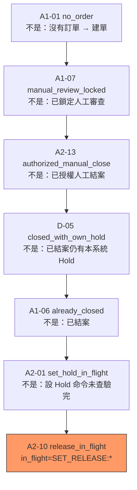

# Case lot_id=LOT1

## 業務路徑

```mermaid
flowchart LR
  n0["order.created\nA1-01"]
  n1["decision.applied\nA1-02"]
  n0 --> n1
  n2["decision.applied\nA1-03"]
  n1 --> n2
  n3["hold.intent\nA1-03"]
  n2 --> n3
  n4["hold.sent\nA1-03"]
  n3 --> n4
  n5["hold.receipt\nA1-03"]
  n4 --> n5
  n6["decision.applied\nA2-01"]
  n5 --> n6
  n7["hold.confirmed\nA2-02"]
  n6 --> n7
  n8["decision.applied\nA2-07"]
  n7 --> n8
  n9["release.intent\nA2-07"]
  n8 --> n9
  n10["release.sent\nA2-07"]
  n9 --> n10
  n11["release.receipt\nA2-07"]
  n10 --> n11
  n12["decision.applied\nA2-10"]
  n11 --> n12
  n13["release.confirmed\nA2-11"]
  n12 --> n13

```

## 決策脊柱 `A2-10` / `release_in_flight`

層級：action_or_decision

## Call stack

- SET_DEFAULT_HOLD_BY_Operation_Start / order.created [A1-01]  (vai_hold/application/pipelines/set_default_hold.py:run:51)
- SET_DEFAULT_HOLD_BY_Operation_Start / decision.applied [A1-02] (select_hold_target)  (vai_hold/domain/derive.py:derive_state:392)
- SET_DEFAULT_HOLD_BY_Operation_Start / decision.applied [A1-03] (need_preventive_hold)  (vai_hold/domain/derive.py:derive_state:420)
- SET_DEFAULT_HOLD_BY_Operation_Start / hold.intent [A1-03]  (vai_hold/domain/derive.py:derive_state:420)
- SET_DEFAULT_HOLD_BY_Operation_Start / hold.sent [A1-03]  (vai_hold/domain/derive.py:derive_state:420)
- SET_DEFAULT_HOLD_BY_Operation_Start / hold.receipt [A1-03]  (vai_hold/domain/derive.py:derive_state:420)
- CONFIRM_DEFAULT_HOLD_EXISTS / decision.applied [A2-01] (set_hold_in_flight)  (vai_hold/application/usecases/verify_hold.py:verify_hold:75)
- CONFIRM_DEFAULT_HOLD_EXISTS / hold.confirmed [A2-02]  (vai_hold/application/usecases/verify_hold.py:verify_hold:66)
- CHECK_AI_SCAN_COMPLETE / decision.applied [A2-07] (ai_ok)  (vai_hold/domain/derive.py:derive_state:277)
- CHECK_AI_SCAN_COMPLETE / release.intent [A2-07]  (vai_hold/domain/derive.py:derive_state:277)
- CHECK_AI_SCAN_COMPLETE / release.sent [A2-07]  (vai_hold/domain/derive.py:derive_state:277)
- CHECK_AI_SCAN_COMPLETE / release.receipt [A2-07]  (vai_hold/domain/derive.py:derive_state:277)
- CONFIRM_DEFAULT_HOLD_RELEASED / decision.applied [A2-10] (release_in_flight)  (vai_hold/domain/derive.py:derive_state:172)
- CONFIRM_DEFAULT_HOLD_RELEASED / release.confirmed [A2-11]  (vai_hold/application/usecases/verify_release.py:verify_release:69)
